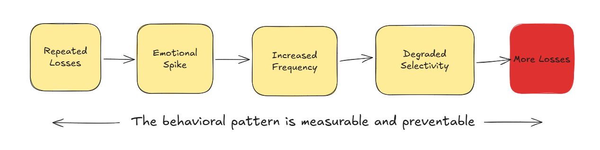

# AIE09 Certification Challenge

# RiskHalo - A Behavioral Risk Intelligence Engine for Intraday Traders

## Deliverables:

### Task 1: Problem, Audience and Scope

1. Write a succinct 1-sentence description of the problem

Retail intraday traders frequently underperform not due to flawed strategies, but because emotional decision-making disrupts disciplined risk management - leading to overtrading, revenge trading, premature profit-taking and failure to cut losses according to predefined rules.

2. Write 1-2 paragraphs on why this is a problem for your specific user

**RiskHalo** targets **Indian F&O intraday retail traders** - a segment where regulatory data from SEBI ((Securities and Exchange Board of India)) indicates that nearly 95% of participants incur losses, with approximately ₹1.8 lakh crore ($2.2 trillion USD) lost over the past three years. This reflects a structural execution problem rather than isolated trading mistakes.

A significant portion of retail traders struggle to consistently follow predefined risk rules. Despite consuming large amounts of market content and strategy material, they lack structured feedback on their execution behavior. Emotional responses such as overtrading, revenge trading, fear of missing out and premature profit-taking frequently override disciplined risk management. Without a systematic trading journal or visibility into recurring loss patterns, traders are unable to diagnose **behavioral distortions** and end up repeating the same execution errors, **leading to rapid drawdowns and eventual capital erosion**.

Beyond financial loss, the psychological impact is substantial. Repeated intraday losses increase stress and impulsivity, often pushing traders to trade more aggressively in an attempt to recover losses, further compounding risk. In an environment where most retail participants lose money, the absence of tools focused on behavioral discipline, risk containment and downside control creates a structural disadvantage. This makes emotional execution failure, rather than strategy selection - one of the primary drivers of trader attrition.

This is a problem worth solving because capital loss driven by emotional and undisciplined execution is the leading cause of retail trader churn in the F&O market.

3. Create a list of questions or input-output pairs that you can use to evaluate your application

**Evaluation questions** - this will later form the RAGAS evaluation dataset

| Input | Expected Output |
|-------|----------------|
|Why do my losses increase after a losing trade?|ystem identifies whether LOSS_ESCALATION exists, references post-loss loss expansion metrics, and explains if risk increases conditionally after losses.|
|Is my behavior unstable after red days?|System evaluates behavioral_state and severity score, determines whether execution degrades post-loss, and states if instability is statistically supported.|
|Am I cutting profits too early?|System evaluates behavioral_state and severity score, determines whether execution degrades post-loss, and states if instability is statistically supported.|
|How is my R:R affecting long-term results?|System explains relationship between average R, expectancy, and win/loss size balance; highlights if low R on winners is suppressing profitability.|
|I follow rules but still lose. Why?|System distinguishes between behavioral stability and structural negative expectancy; clarifies that discipline does not guarantee profitability if edge is weak.|
|Are my winners too small?|System analyzes average win R and minimum R:R compliance; identifies whether profit compression exists.|
|Am I improving over time?|System compares severity, expectancy, and discipline scores across sessions and determines if trends show improvement, deterioration, or stability.|
|Is my recovery behavior healthy?|System evaluates ADAPTIVE_RECOVERY vs LOSS_ESCALATION and determines whether performance improves or deteriorates after losses.|
|When was my severity highest?|System identifies the session with the maximum severity_score and reports the corresponding behavioral_state.|
|When did expectancy drop most?|System compares expectancy_delta across sessions and identifies the session with the largest negative shift.|
|Am I improving compared to previous sessions?|System compares expectancy_delta across sessions and identifies the session with the largest negative shift.|
|Are wins shrinking after losses?|Win shrink %|
|Is trader stable under pressure?|STABLE/ADAPTIVE/CONTRACTION|

### Task 2: Propose a Solution

4. Write 1-2 paragraphs on your proposed solution. How will it look and feel to the user? Describe the tools you plan to use to build it.

RiskHalo is designed as a Behavioral Risk Intelligence Engine that transforms raw trade data into structured behavioral diagnostics and actionable execution feedback. The system analyzes weekly trade uploads, computes deterministic performance and behavioral metrics and generates a structured session summary highlighting behavioral state classification, severity, expectancy shifts and rule compliance. Instead of predicting markets, RiskHalo focuses strictly on execution discipline, identifying whether performance degradation is driven by emotional distortion, structural expectancy issues, or rule violations. The user experience is analytical, data-backed and performance-oriented, resembling a trading performance dashboard combined with a disciplined execution coach.

From a technical standpoint, the system is built using a modular architecture. A parsing layer processes structured trade data, followed by deterministic Behavioral, Expectancy and Rule Compliance engines. Session summaries are embedded using the OpenAI API and stored in a ChromaDB vector database to enable retrieval-augmented analysis across historical sessions. A multi-query retriever and structured system prompt power the coaching layer, ensuring responses remain grounded in session data. Evaluation is conducted using RAGAS to measure retrieval quality, faithfulness and behavioral grounding. The overall design prioritizes determinism, traceability and measurable performance improvement over heuristic or speculative outputs.

As the behavioral pattern is the same , the *real insight of the MVP is NOT* **"How to make money"** but **"How to stop leaking money, to reduce the drawdowns/losses"**.

5. Create an infrastructure diagram of your stack showing how everything fits together.  Write one sentence on why you made each tooling choice.

| Sr.No. |Tool  |Tooling Choice Reason|
|-------|----------------|----------------|
|1|LLM(s) – OpenAI (gpt-4o-mini)|Chosen for its high performance, a 128K context window and cost effective pricing, provides decent intelligence which is enough for the certification challenege.|
|2|Agent Orchestration Framework – Lightweight Custom Orchestration (LangGraph-style flow)|Used to enforce deterministic control over retrieval, reasoning steps and structured response formatting without introducing unnecessary complexity.|
|3|Tool(s) - Deterministic Analytics Engines (Feature, Behavioral, Expectancy, Rule Compliance), Tavily API|Implemented as pure Python modules to ensure explainability, auditability and mathematically traceable behavioral diagnostics. Using Tavily API for web search as a tool to coaching agent.|
|4|Embedding Model – OpenAI Embeddings API (text-embedding-3-small)|Selected for high semantic quality and strong performance on financial and behavioral language, improving retrieval accuracy.|
|5|Vector Database – ChromaDB|Chosen for its lightweight setup, metadata filtering support and seamless integration for hybrid semantic + state-aware retrieval.|
|6|Monitoring Tool – Logging + RAGAS Metrics|Used to track retrieval quality, faithfulness and grounding performance in a measurable and reproducible way.|
|7|Evaluation Framework – RAGAS|Selected to quantitatively assess context recall, context precision, faithfullness, response relevancy|
|8|User Interface|ReactJS + Javascript on the frontend and Python on the backend, both are known tech|
|9|Deployment Tool - Vercel|Vercel for seamless and easy deployments.|
|10|Other Key Component – Multi-Query Retriever|Implemented to improve context recall by expanding user intent into multiple semantically aligned retrieval queries.|

6. What are the RAG and agent components of your project, exactly?

RAG Components in RiskHalo:

a) Document Source:

    - Weekly Session Summaries
        - Generated by deterministic engines
        - Contain behavioral_state, severity_score, expectancy metrics, rule compliance metrics
        - Stored as structured narrative + metadata

b) Embedding Layer:

    - OpenAI Embedding Model
        - Converts session summaries into dense vector representations
        - Converts user queries into query embeddings

c) Vector Store:

    - ChromaDB
        - Stores: session_id, embedding vector, document (narrative summary), metadata (behavioral_state, severity_score, etc.)
        - Supports semantic similarity search
        - Supports metadata filtering (where={"behavioral_state": ...})

d) Retriever:

    - Multi-Query Retriever
        - Expands user question into multiple semantically aligned queries
        - Retrieves top-k relevant session summaries
        - Optionally applies behavioral_state metadata filter
        - Returns: retrieved_contexts, retrieved_metadatas
This is the core RAG retrieval mechanism.

e) Generator:

    - LLM (OpenAI GPT-4 class model)
        - Receives: System prompt, Retrieved session summaries, User question
        - Produces: Structured 4-section coaching response
This completes the RAG loop:
Query → Embed → Retrieve → Grounded Generate

Agent Components in RiskHalo:

a) Coach Agent:

    - This is your primary agent.
    - Responsibilities:
        - Calls retriever
        - Injects retrieved context into prompt
        - Enforces strict response structure
        - Ensures behavioral grounding
        - Prevents hallucination
        - It orchestrates the RAG flow.
        
    - It does NOT:
        - Compute metrics
        - Modify data
        - Calls Tavily API tool if required

It is a controlled reasoning agent.

b) Deterministic Engines (Tool-like Components)

    - While not traditional LLM tools, these act as deterministic sub-systems: 
        - FeatureEngine
        - BehavioralEngine
        - ExpectancyEngine
        - RuleComplianceEngine
These are invoked before RAG and provide structured truth.